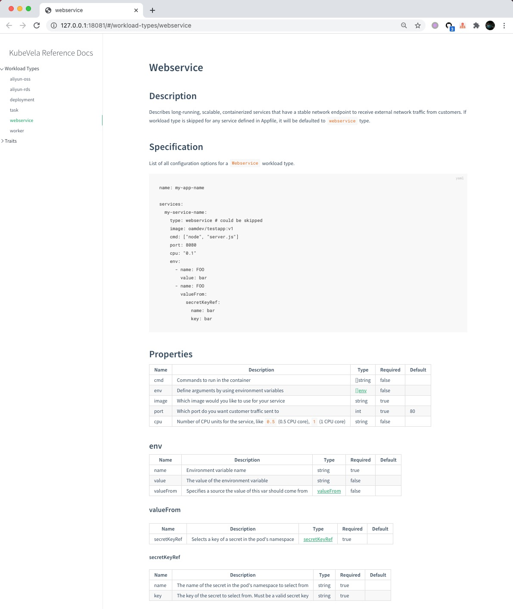
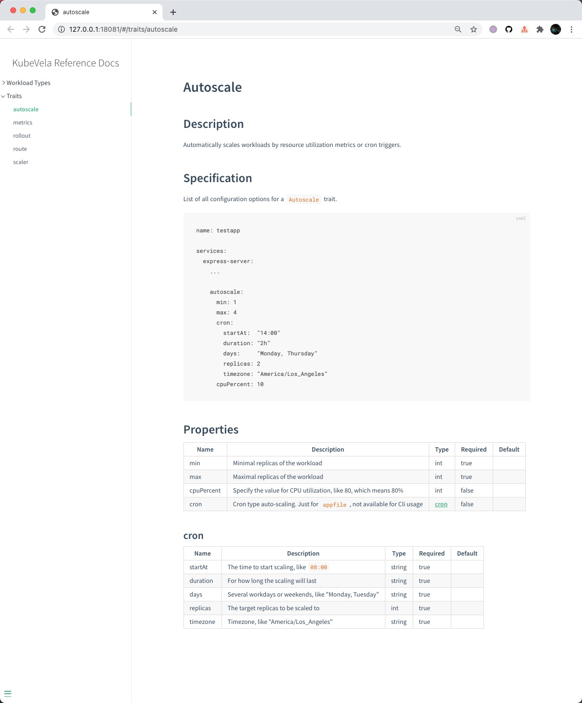

## The Reference Documentation of Capabilities

In this documentation, we will show how to check the detailed schema of a given capability (i.e. workload type or trait). 

This may sound challenging because every capability is a "plug-in" in KubeVela (even for the built-in ones), also, it's by design that KubeVela allows platform administrators to modify the capability templates at any time. In this case, do we need to manually write documentation for every newly installed capability? And how can we ensure those documentations for the system is up-to-date?

## Using Browser

Actually, as a important part of its "extensibility" design, KubeVela will always **automatically generate** reference documentation for every workload type or trait registered in your Kubernetes cluster, based on the template in its definition of course. This feature works for any capability: either built-in ones or your own workload types/traits.

Thus, as an end user, the only thing you need to do is:

```console
$ vela show WORKLOAD_TYPE or TRAIT
```

This command will automatically open the reference documentation for given workload type or trait in your default browser.

Let's take `$ vela show webservice` as example. The detailed schema documentation for `Web Service` workload type will show up immediately as below:



Note that there's in the section named `Specification`, it even provides you with a full sample for the usage of this workload type with a fake name `my-service-name`.

Similarly, we can also do `$ vela show autoscale`:



With these auto-generated reference documentations, we could easily complete the application description by simple copy-paste, for example:

```yaml
name: helloworld

services:
  backend: # copy-paste from the webservice ref doc above
    image: oamdev/testapp:v1
    cmd: ["node", "server.js"]
    port: 8080
    cpu: "0.1"

    autoscale: # copy-paste and modify from autoscaler ref doc above
      min: 1
      max: 8
      cron:
        startAt:  "19:00"
        duration: "2h"
        days:     "Friday"
        replicas: 4
        timezone: "America/Los_Angeles"
```

## Using Terminal

This reference doc feature also works for terminal-only case. For example:

```shell
$ vela show webservice --no-website
# Properties
+-------+----------------------------------------------------------------------------------+---------------+----------+---------+
| NAME  |                                   DESCRIPTION                                    |     TYPE      | REQUIRED | DEFAULT |
+-------+----------------------------------------------------------------------------------+---------------+----------+---------+
| cmd   | Commands to run in the container                                                 | []string      | false    |         |
| env   | Define arguments by using environment variables                                  | [[]env](#env) | false    |         |
| image | Which image would you like to use for your service                               | string        | true     |         |
| port  | Which port do you want customer traffic sent to                                  | int           | true     |      80 |
| cpu   | Number of CPU units for the service, like `0.5` (0.5 CPU core), `1` (1 CPU core) | string        | false    |         |
+-------+----------------------------------------------------------------------------------+---------------+----------+---------+


## env
+-----------+-----------------------------------------------------------+-------------------------+----------+---------+
|   NAME    |                        DESCRIPTION                        |          TYPE           | REQUIRED | DEFAULT |
+-----------+-----------------------------------------------------------+-------------------------+----------+---------+
| name      | Environment variable name                                 | string                  | true     |         |
| value     | The value of the environment variable                     | string                  | false    |         |
| valueFrom | Specifies a source the value of this var should come from | [valueFrom](#valueFrom) | false    |         |
+-----------+-----------------------------------------------------------+-------------------------+----------+---------+


### valueFrom
+--------------+--------------------------------------------------+-------------------------------+----------+---------+
|     NAME     |                   DESCRIPTION                    |             TYPE              | REQUIRED | DEFAULT |
+--------------+--------------------------------------------------+-------------------------------+----------+---------+
| secretKeyRef | Selects a key of a secret in the pod's namespace | [secretKeyRef](#secretKeyRef) | true     |         |
+--------------+--------------------------------------------------+-------------------------------+----------+---------+


#### secretKeyRef
+------+------------------------------------------------------------------+--------+----------+---------+
| NAME |                           DESCRIPTION                            |  TYPE  | REQUIRED | DEFAULT |
+------+------------------------------------------------------------------+--------+----------+---------+
| name | The name of the secret in the pod's namespace to select from     | string | true     |         |
| key  | The key of the secret to select from. Must be a valid secret key | string | true     |         |
+------+------------------------------------------------------------------+--------+----------+---------+
```

## For Built-in Capabilities

Note that for all the built-in capabilities, we already published their reference docs below based on the same doc generation mechanism.


- Workload Types
	- [webservice](workload-types/webservice)
	- [task](workload-types/task)
	- [worker](workload-types/worker)
- Traits
	- [route](traits/route)
	- [autoscale](traits/autoscale)
	- [rollout](traits/rollout)
	- [metrics](traits/metrics)
	- [scaler](traits/scaler)